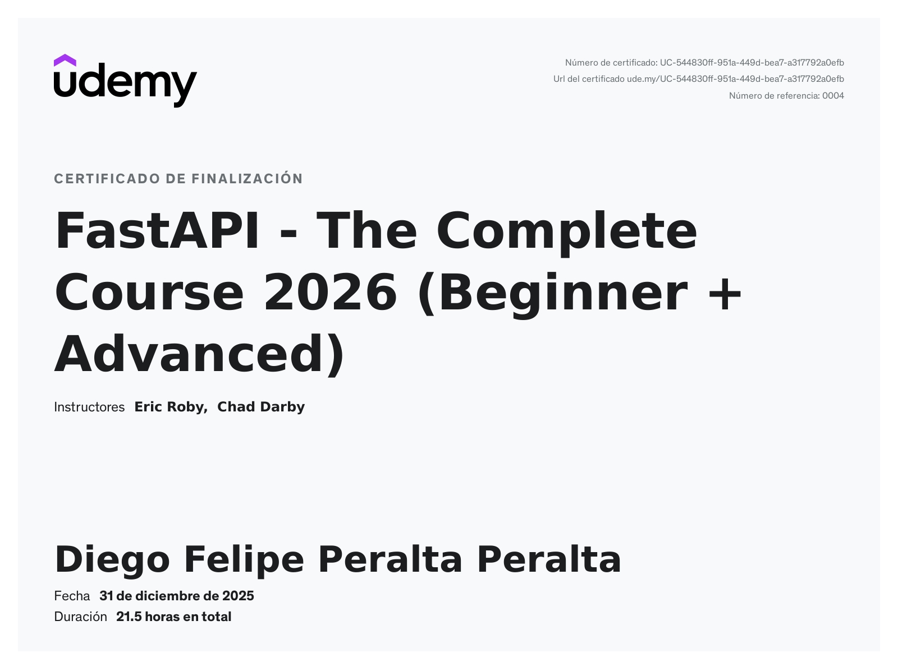

# FastAPI - The Complete Course 2026 (Beginner + Advanced)

Este repositorio contiene todo el material, proyectos y documentación del curso completo de FastAPI en Udemy, junto con investigaciones profundas sobre tecnologías y conceptos del framework.

**Curso Original**: [FastAPI - The Complete Course 2026 (Beginner + Advanced)](https://www.udemy.com/course/fastapi-the-complete-course/)



## Descripción del Curso

FastAPI es uno de los frameworks web más modernos y rápidos para construir APIs con Python. Este curso completo cubre desde los fundamentos básicos hasta técnicas avanzadas, incluyendo:

- Fundamentos de Python y programación orientada a objetos
- Desarrollo de APIs RESTful completas
- Autenticación y autorización con JWT
- Manejo de bases de datos con SQLAlchemy
- Migraciones de base de datos con Alembic
- Testing unitario e integración con pytest
- Aplicaciones full stack con Jinja2
- Despliegue en la nube con Render

## Estructura del Repositorio

### Fundamentos de Python

#### [p02_python_refresher/](p02_python_refresher/)

Repaso completo de Python con ejercicios prácticos:

- **Variables y Tipos de Datos**: Strings, números, booleanos
- **Estructuras de Datos**: Listas, tuplas, sets, diccionarios
- **Control de Flujo**: Condicionales y bucles
- **Funciones**: Definición, parámetros, retornos
- **POO**: Clases, herencia, encapsulamiento, polimorfismo
- **Imports y Módulos**: Organización de código

### FastAPI - Fundamentos

#### [p03_fastapi_overview_setup_installation/](p03_fastapi_overview_setup_installation/)

- Introducción a FastAPI
- Características principales del framework
- Instalación y configuración del entorno de desarrollo
- Comparación con otros frameworks Python

#### [p04_project_1_request_method/](p04_project_1_request_method/)

**Proyecto 1: Métodos HTTP Básicos**:

- Endpoints GET, POST, PUT, DELETE
- Path parameters y query parameters
- Validación de datos con Pydantic
- Documentación automática con Swagger UI

**Características**:

- API de libros simple
- CRUD básico en memoria
- Introducción a decoradores de ruta

#### [p05_project_2_move_fast/](p05_project_2_move_fast/)

**Proyecto 2: Validación Avanzada**:

- Modelos Pydantic completos
- Field validators personalizados
- Status codes HTTP apropiados
- Manejo de errores y excepciones

**Mejoras sobre Proyecto 1**:

- Validación estricta de datos
- Response models
- Mejor estructura de código

### FastAPI - Nivel Intermedio

#### [p06_project_3_complete_restful_apis/](p06_project_3_complete_restful_apis/)

**Proyecto 3: API RESTful Completa con Autenticación**:

Sistema completo de gestión de tareas (TodoApp) con arquitectura profesional.

**Características principales**:

- **Base de Datos**: SQLAlchemy con SQLite
- **Autenticación JWT**: Login, registro, tokens
- **Routers Modulares**: auth, todos, admin, users
- **Inyección de Dependencias**: Manejo de sesiones BD y usuarios
- **Hashing de Contraseñas**: bcrypt con passlib
- **CRUD Completo**: Operaciones sobre tareas y usuarios

**Documentación**:

- [README.md](p06_project_3_complete_restful_apis/README.md): Guía completa del proyecto
- [AUTH_DOCUMENTACION.md](p06_project_3_complete_restful_apis/AUTH_DOCUMENTACION.md): Sistema de autenticación
- [TODOS_DOCUMENTACION.md](p06_project_3_complete_restful_apis/TODOS_DOCUMENTACION.md): Gestión de tareas

**Routers**:

- `auth.py`: Registro, login, tokens JWT
- `todos.py`: CRUD de tareas con filtrado por usuario
- `admin.py`: Panel administrativo
- `users.py`: Gestión de perfiles de usuario

#### [p07_project_3_5_alembic_data_migration/](p07_project_3_5_alembic_data_migration/)

**Proyecto 3.5: Migraciones con Alembic**:

Extensión del Proyecto 3 con sistema de control de versiones de base de datos.

**Características**:

- Configuración de Alembic
- Migraciones automáticas y manuales
- Agregar campo `phone_number` a tabla Users
- Upgrade y downgrade de esquemas
- Historial de migraciones

**Aprendizajes**:

- Alembic CLI y comandos
- Archivo `alembic.ini` y `env.py`
- Generación automática de migraciones
- Resolución de conflictos
- Buenas prácticas de versionado

[Ver documentación completa](p07_project_3_5_alembic_data_migration/README.md)

### FastAPI - Nivel Avanzado

#### [p08_project_4_unit_integration_testing/](p08_project_4_unit_integration_testing/)

**Proyecto 4: Testing Completo**:

Suite de pruebas profesional con pytest para garantizar calidad del código.

**Características**:

- **25+ Tests**: Cobertura completa de la aplicación
- **Fixtures**: Configuración reutilizable de BD y usuarios
- **TestClient**: Simulación de peticiones HTTP
- **Mocking**: Override de dependencias
- **Organización**: Tests por módulo (auth, todos, admin, users)

**Tipos de Tests**:

- Tests unitarios de funciones
- Tests de integración de routers
- Tests de autenticación y autorización
- Tests de validación de datos
- Tests de casos de error

**Herramientas**:

- pytest
- pytest-asyncio
- TestClient de FastAPI
- Base de datos de prueba en memoria

[Ver documentación de testing](p08_project_4_unit_integration_testing/README.md)

#### [p09_project_5_full_stack_application/](p09_project_5_full_stack_application/)

**Proyecto 5: Aplicación Full Stack con Jinja2**:

Transformación de la API REST en una aplicación web completa con interfaz de usuario.

**Características principales**:

- **Templates Jinja2**: Renderizado del servidor
- **Autenticación con Cookies**: JWT almacenado en cookies HTTP
- **Interfaz Completa**: Login, registro, CRUD de tareas
- **Bootstrap 4**: UI responsive y moderna
- **JavaScript**: Interacciones asíncronas con Fetch API
- **Arquitectura Híbrida**: Páginas HTML + API REST

**Páginas**:

- Login y registro de usuarios
- Dashboard de tareas
- Formularios para agregar/editar tareas
- Navbar con estado de autenticación

**Tecnologías**:

- Jinja2Templates
- StaticFiles para CSS/JS
- Herencia de templates
- Renderizado condicional
- Form handling con JavaScript

[Ver documentación full stack](p09_project_5_full_stack_application/README.md)

### Despliegue y Control de Versiones

#### [p10_deploying_fastapi_applications/](p10_deploying_fastapi_applications/)

**Despliegue en la Nube**:

Guías completas para llevar aplicaciones FastAPI a producción.

**Contenido**:

- **Render**: Despliegue en plataforma PaaS
  - Configuración paso a paso
  - CI/CD automático desde GitHub
  - Variables de entorno
  - Monitoreo y logs
  - Custom domains
- **Best Practices**: Configuración de producción
- **Requirements.txt**: Gestión de dependencias

**Aplicación Desplegada**: [TodoApp en Render](https://fastapi-deployfepdev25.onrender.com/auth/login-page)

[Ver guía de despliegue](p10_deploying_fastapi_applications/render.md)

## Documentación Extendida

### [docs/](docs/)

Investigaciones profundas realizadas con DeepResearch para dominar conceptos avanzados de FastAPI y tecnologías relacionadas.

#### Manuales Maestros

**[Manual Maestro Inyección Dependencias FastAPI/](docs/Manual%20Maestro%20Inyección%20Dependencias%20FastAPI/)**

- Sistema de inyección de dependencias de FastAPI
- Dependency injection patterns
- Scopes y lifecycle de dependencias
- Testing con override de dependencias
- Casos de uso avanzados
- Yield dependencies y cleanup

#### Investigaciones Específicas

**[Teoría de FastAPI sin código/](docs/Teoría%20de%20FastAPI%20sin%20código/)**

- Fundamentos teóricos del framework
- Conceptos de async/await en Python
- Event loop y concurrencia
- ASGI vs WSGI
- Arquitectura interna de FastAPI
- Performance y benchmarks

## Tecnologías Utilizadas

### Backend

- **FastAPI**: Framework web moderno y rápido
- **Python 3.10+**: Lenguaje de programación
- **Uvicorn**: Servidor ASGI
- **SQLAlchemy**: ORM para base de datos
- **Alembic**: Migraciones de base de datos
- **Pydantic**: Validación de datos
- **python-jose**: JWT tokens
- **passlib**: Hashing de contraseñas
- **bcrypt**: Algoritmo de hashing

### Frontend

- **Jinja2**: Motor de templates
- **Bootstrap 4**: Framework CSS
- **JavaScript**: Interactividad del cliente
- **Fetch API**: Peticiones HTTP asíncronas

### Testing

- **pytest**: Framework de testing
- **pytest-asyncio**: Tests asíncronos
- **TestClient**: Cliente HTTP de prueba

### Base de Datos

- **SQLite**: BD local para desarrollo
- **PostgreSQL**: BD para producción (Render)

### Deployment

- **Render**: Plataforma PaaS
- **Git/GitHub**: Control de versiones
- **GitHub Actions**: CI/CD (potencial)

## Habilidades Desarrolladas

Al completar este curso y los proyectos, se adquieren las siguientes competencias:

### Backend Development

- Diseño y desarrollo de APIs RESTful completas
- Implementación de autenticación y autorización
- Manejo de bases de datos relacionales con ORM
- Migraciones y versionado de esquemas
- Testing unitario e integración
- Manejo de errores y validaciones
- Seguridad web (hashing, tokens, CORS)

### Arquitectura

- Separación de responsabilidades (routers, models, database)
- Inyección de dependencias
- Patrones de diseño aplicados
- Código modular y reutilizable
- Escalabilidad y mantenibilidad

### DevOps

- Control de versiones con Git
- Despliegue en la nube
- CI/CD con plataformas PaaS
- Variables de entorno y configuración
- Monitoreo y logging

### Full Stack

- Integración frontend-backend
- Renderizado del servidor con templates
- Autenticación basada en cookies
- Manejo de formularios
- Arquitectura híbrida (páginas + API)

## Proyectos Destacados

### TodoApp - Sistema de Gestión de Tareas

Aplicación completa que evoluciona a través de múltiples proyectos:

1. **v1.0 (Proyecto 3)**: API REST con autenticación
2. **v1.5 (Proyecto 3.5)**: Migraciones con Alembic
3. **v2.0 (Proyecto 4)**: Suite de tests completa
4. **v3.0 (Proyecto 5)**: Interfaz web full stack
5. **v3.1 (Proyecto 6)**: Desplegado en Render

**Características finales**:

- Registro y login de usuarios
- Gestión completa de tareas (CRUD)
- Filtrado por usuario autenticado
- Panel administrativo
- Gestión de perfil de usuario
- Interfaz web responsive
- Disponible en la nube

## Instalación y Uso

### Requisitos Previos

```bash
# Python 3.10 o superior
python --version

# pip actualizado
pip install --upgrade pip
```

### Clonar Repositorio

```bash
git clone https://github.com/tu-usuario/fastapi-course.git
cd fastapi-course
```

### Crear Entorno Virtual

```bash
# Crear entorno virtual
python -m venv .venv

# Activar (Linux/Mac)
source .venv/bin/activate

# Activar (Windows)
.venv\Scripts\activate
```

### Instalar Dependencias

Cada proyecto tiene su propio `requirements.txt`:

```bash
# Ejemplo: Proyecto 6 (Full Stack)
cd p06_project_3_complete_restful_apis
pip install -r requirements.txt
```

**Dependencias comunes**:

```bash
fastapi>=0.104.1
uvicorn[standard]>=0.24.0
sqlalchemy>=2.0.23
alembic>=1.12.1
python-jose[cryptography]>=3.3.0
passlib[bcrypt]>=1.7.4
python-multipart>=0.0.6
jinja2>=3.1.2
pytest>=7.4.3
```

### Ejecutar Aplicación

```bash
# Desarrollo
uvicorn main:app --reload

# Producción
uvicorn main:app --host 0.0.0.0 --port 8000 --workers 4
```

**Acceder**:

- Aplicación: <http://localhost:8000>
- Documentación Swagger: <http://localhost:8000/docs>
- Documentación ReDoc: <http://localhost:8000/redoc>

### Ejecutar Migraciones (Proyectos 3.5+)

```bash
# Generar migración
alembic revision --autogenerate -m "Descripción"

# Aplicar migraciones
alembic upgrade head

# Revertir última migración
alembic downgrade -1
```

### Ejecutar Tests (Proyecto 4+)

```bash
# Todos los tests
pytest

# Con verbose
pytest -v

# Tests específicos
pytest test/test_todos.py

# Con coverage
pytest --cov=. --cov-report=html
```

## Progresión del Aprendizaje

### Nivel Principiante (Proyectos 1-2)

- HTTP methods y routing
- Path y query parameters
- Request/Response models
- Validación básica con Pydantic
- Documentación automática

### Nivel Intermedio (Proyectos 3-3.5)

- Integración con bases de datos
- Autenticación JWT
- Hashing de contraseñas
- Inyección de dependencias
- Migraciones de BD
- Routers modulares

### Nivel Avanzado (Proyectos 4-5)

- Testing completo
- Full stack development
- Templates Jinja2
- Autenticación con cookies
- Arquitectura híbrida
- JavaScript integration

### Nivel Producción (Proyecto 6)

- Despliegue en la nube
- CI/CD pipelines
- Variables de entorno
- Monitoreo y logging
- Performance optimization
- Security hardening

## Recursos Adicionales

### Documentación Oficial

- [FastAPI Docs](https://fastapi.tiangolo.com/)
- [Pydantic Docs](https://docs.pydantic.dev/)
- [SQLAlchemy Docs](https://docs.sqlalchemy.org/)
- [Alembic Docs](https://alembic.sqlalchemy.org/)
- [pytest Docs](https://docs.pytest.org/)

### Comunidad

- [FastAPI GitHub](https://github.com/tiangolo/fastapi)
- [FastAPI Discord](https://discord.gg/fastapi)
- [Stack Overflow - FastAPI Tag](https://stackoverflow.com/questions/tagged/fastapi)

### Herramientas

- [Postman](https://www.postman.com/): Testing de APIs
- [DBeaver](https://dbeaver.io/): Cliente de base de datos
- [VS Code](https://code.visualstudio.com/): Editor recomendado
- [GitHub Copilot](https://github.com/features/copilot): Asistente AI

## Mejores Prácticas Aplicadas

### Código

- Tipo hints en todas las funciones
- Documentación con docstrings
- Nombres descriptivos de variables y funciones
- Separación de responsabilidades
- DRY (Don't Repeat Yourself)

### Seguridad

- Nunca hardcodear secretos
- Usar variables de entorno
- Hashing de contraseñas
- Validación de entrada
- CORS configurado correctamente
- SQL injection prevention (ORM)

### Mejores prácticas en Testing

- Tests para cada endpoint
- Fixtures reutilizables
- Cobertura alta de código
- Tests de casos de error
- Tests de autorización

### Mejores prácticas en Base de Datos

- Migraciones versionadas
- Índices en campos frecuentes
- Relaciones bien definidas
- Constraints apropiadas
- Backup strategy

### Mejores prácticas en Deployment

- Requirements.txt actualizado
- .gitignore configurado
- Variables de entorno separadas
- Health check endpoints
- Logging apropiado

## Certificado

Este repositorio representa la culminación del curso completo de FastAPI en Udemy. El certificado oficial del curso se encuentra en la siguiente url:

[Ver Certificado](https://www.udemy.com/certificate/UC-544830ff-951a-449d-bea7-a317792a0efb/?utm_campaign=email&utm_medium=email&utm_source=sendgrid.com)

**Datos del Certificado**:

- Curso: FastAPI - The Complete Course 2026 (Beginner + Advanced)
- Plataforma: Udemy
- ID: UC-544830ff-951a-449d-bea7-a317792a0efb

## Licencia

Este repositorio contiene material educativo del curso de Udemy junto con implementaciones y documentación personales. El código desarrollado en los proyectos es de uso libre para fines educativos.

## Autor

**Felipe P.**

Desarrollador Python especializado en FastAPI y desarrollo backend.

## Agradecimientos

- **Eric Roby**: Instructor del curso en Udemy
- **Sebastián Ramírez (tiangolo)**: Creador de FastAPI
- **Comunidad FastAPI**: Por la excelente documentación y soporte
- **DeepResearch**: Por las investigaciones profundas sobre conceptos avanzados

---

**Nota**: Este repositorio está en constante actualización con nuevos proyectos, mejoras y documentación adicional.

**Última actualización**: Diciembre 2025
