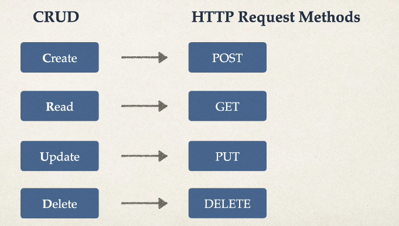
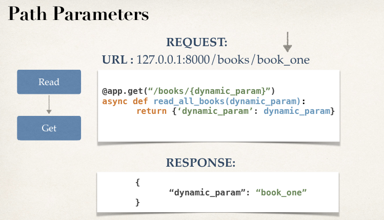
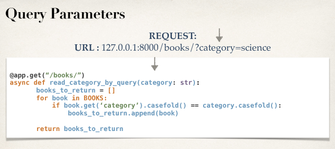

# Project 1: FastAPI Request Method Logic

- Creating and enhancing books to learn the basics of FastAPI

## CRUD OPerations

- Create
- Read
- Update
- Delete

## Request and Response

- The web page is going to send a request to the FastAPI server, and FastAPI is going to send a response back to the web page.
- When the web page is going to be requesting information from FastAPI, it is going to request it by using HTTP request methods.
- The HTTP request methos are a way for thw web page to communicate to the server what type of request they are asking for: CRUD
- Swagger UI: Spins up slash docs which will bring us to the swagger UI, is going to have a list of all the request methods we are able to call from FastAPI.

## HTTP Request Methods

- 

## Path Parameters

- Path paramteres are request parameters that have been attached to the URL.
- Are usually defined as a way to find information based on location.
- 

## Query Parameters

- Querey paramters are request parameters that have been attached after a ?
- Example: 127.0.0.1:8000/books/?category=math
- 
