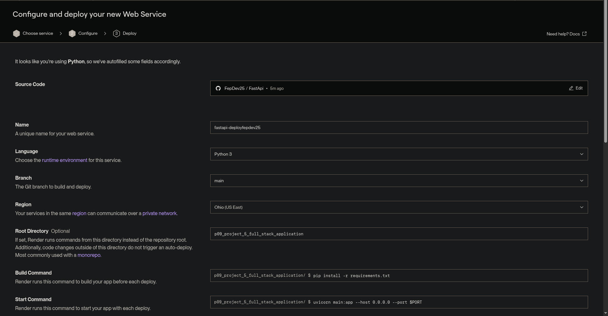
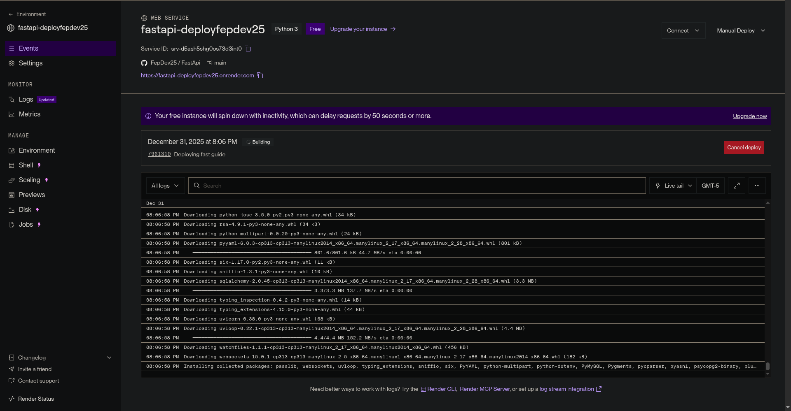

# Despliegue de Aplicaciones FastAPI en Render

## ¿Qué es Render?

Render es una Plataforma como Servicio (PaaS) moderna que permite a los desarrolladores construir, ejecutar y operar aplicaciones completamente en la nube sin preocuparse por la gestión de infraestructura.

### Características Principales

Definición y Propósito:

- Plataforma cloud que abstrae la complejidad de la infraestructura
- Permite a los desarrolladores enfocarse exclusivamente en escribir código
- Automatiza el proceso de despliegue y mantenimiento de aplicaciones

Capacidades Técnicas:

- CI/CD Integrado: Integración Continua y Despliegue Continuo automático
- Balanceo de Carga: Distribución automática del tráfico
- Escalabilidad: Ajuste de recursos según demanda
- HTTPS Automático: Certificados SSL incluidos
- Monitoreo: Dashboards de rendimiento y logs en tiempo real

Planes y Costos:

- Plan Gratuito: Disponible para proyectos personales y pruebas
- Prueba Gratuita: Sin necesidad de tarjeta de crédito inicialmente
- Planes Pagos: Escalables según necesidades de rendimiento y recursos
- Variables de precio: CPU, RAM, ancho de banda, tiempo de actividad

Uso Empresarial:

- Utilizado por startups y empresas de todos los tamaños
- Infraestructura confiable para producción
- Alternativa moderna a plataformas tradicionales como Heroku

### Analogía

Usar Render es como alquilar una cocina profesional totalmente equipada: tú solo traes tus ingredientes y recetas (tu código), y la plataforma se encarga de mantener los hornos, el gas y la electricidad (la infraestructura) para que puedas servir tus platillos al público sin complicaciones técnicas.

## Requisitos Previos

Antes de desplegar en Render, necesitas:

1. Cuenta en Render: Crear cuenta gratuita en [render.com](https://render.com)
2. Repositorio en GitHub: Tu proyecto FastAPI debe estar en GitHub
3. Archivo `requirements.txt`: Lista de dependencias Python
4. Aplicación FastAPI funcional: Probada localmente

## Preparación del Proyecto

### 1. Generar requirements.txt

El archivo `requirements.txt` lista todas las dependencias que tu aplicación necesita. Render lo usa para instalar los paquetes correctos.

Comando:

```bash
pip freeze > requirements.txt
```

Este comando:

- Captura todas las librerías instaladas en tu entorno virtual
- Incluye las versiones exactas de cada paquete
- Genera un archivo que Render puede usar para replicar tu entorno

Ejemplo de requirements.txt:

```bash
fastapi==0.104.1
uvicorn==0.24.0
sqlalchemy==2.0.23
alembic==1.12.1
python-jose[cryptography]==3.3.0
passlib[bcrypt]==1.7.4
python-multipart==0.0.6
jinja2==3.1.2
```

### 2. Verificar Estructura del Proyecto

Asegúrate de que tu proyecto tenga:

```bash
tu-proyecto/
├── main.py                 # Punto de entrada de la aplicación
├── requirements.txt        # Dependencias
├── database.py            # Configuración de base de datos
├── models.py              # Modelos SQLAlchemy
├── routers/               # Módulos de rutas
├── templates/             # Templates Jinja2 (si aplica)
├── static/                # Archivos estáticos (si aplica)
└── .gitignore            # Archivos a ignorar
```

### 3. Configurar .gitignore

Evita subir archivos innecesarios a GitHub:

```bash
__pycache__/
*.pyc
*.pyo
*.db
*.sqlite
*.sqlite3
venv/
env/
.env
.venv
```

### 4. Subir a GitHub

```bash
git init
git add .
git commit -m "Preparar aplicación para despliegue"
git branch -M main
git remote add origin https://github.com/tu-usuario/tu-repo.git
git push -u origin main
```

## Proceso de Despliegue en Render

### Paso 1: Crear Web Service

1. Iniciar sesión en [render.com](https://render.com)
2. En el Dashboard, hacer clic en "New +"
3. Seleccionar "Web Service"

Este tipo de servicio es para aplicaciones web que:

- Responden a peticiones HTTP/HTTPS
- Están continuamente activas
- Sirven contenido web o APIs

### Paso 2: Conectar con GitHub

Render necesita acceso a tu código para desplegarlo automáticamente.

Opciones:

1. Connect Account: Vincular tu cuenta de GitHub
2. Configure Permissions: Dar acceso a repositorios específicos o todos
3. Authorize Render: Confirmar permisos

Seguridad:

- Render solo lee el código para desplegar
- No modifica tu repositorio
- Puedes revocar el acceso en cualquier momento



### Paso 3: Seleccionar Repositorio

1. Buscar: Filtrar por nombre de repositorio
2. Connect: Hacer clic en el repositorio a desplegar
3. Branch: Por defecto usa la rama `main` o `master`

Nota: Solo verás los repositorios a los que Render tenga acceso.

### Paso 4: Configurar el Servicio

Render presenta un formulario con las siguientes opciones:

#### Configuración Básica

Name:

- Nombre único para tu servicio
- Ejemplo: `fastapi-todoapp` o `mi-aplicacion-fastapi`
- Se usa para generar la URL: `https://tu-nombre.onrender.com`

Region:

- Ubicación del servidor
- Opciones: `Oregon (US West)`, `Frankfurt (EU Central)`, `Ohio (US East)`, `Singapore (Asia Pacific)`
- Elegir la más cercana a tus usuarios para menor latencia

Branch:

- Rama de Git a desplegar
- Generalmente `main` o `master`
- Render redesplega automáticamente con cada push a esta rama

Root Directory:

- Directorio raíz del proyecto
- Dejar vacío si `main.py` está en la raíz
- Especificar subdirectorio si tu app está en carpeta específica
  - Ejemplo: `backend/` o `TodoApp/`

#### Configuración de Runtime

Runtime:

- Seleccionar "Python 3"
- Render detecta automáticamente que es un proyecto Python por `requirements.txt`

Build Command:

- Comando que Render ejecuta para preparar tu aplicación
- Por defecto: `pip install -r requirements.txt`
- Puedes agregar comandos adicionales:

  ```bash
  pip install -r requirements.txt && alembic upgrade head
  ```

Start Command:

- Comando para iniciar tu aplicación FastAPI
- Crítico: Debe ser correcto para que la app funcione

Opciones comunes:

```bash
# Opción 1: Básica
uvicorn main:app --host 0.0.0.0 --port $PORT

# Opción 2: Con workers (recomendado para producción)
uvicorn main:app --host 0.0.0.0 --port $PORT --workers 4

# Opción 3: Con Gunicorn (más robusto)
gunicorn main:app --workers 4 --worker-class uvicorn.workers.UvicornWorker --bind 0.0.0.0:$PORT
```

Explicación de parámetros:

- `main:app`: Módulo `main.py` y variable `app`
- `--host 0.0.0.0`: Escuchar en todas las interfaces de red
- `--port $PORT`: Usar el puerto que Render asigna dinámicamente
- `--workers 4`: Número de procesos worker (ajustar según plan)

#### Plan de Servicio

Free:

- 512 MB RAM
- CPU compartida
- Se suspende después de 15 minutos de inactividad
- Reinicio lento al recibir tráfico (cold start ~30 segundos)
- Ideal para: demos, proyectos personales, pruebas

Starter ($7/mes):

- 512 MB RAM
- Siempre activo (no se suspende)
- Sin cold starts
- Ideal para: aplicaciones pequeñas en producción

Standard y superiores:

- Más recursos (RAM, CPU)
- Mejor rendimiento
- Ideal para: aplicaciones con tráfico alto

### Paso 5: Variables de Entorno (Opcional)

Si tu aplicación usa variables de entorno (API keys, secrets, configuraciones):

1. Expandir "Advanced"
2. Hacer clic en "Add Environment Variable"
3. Agregar pares clave-valor:

   ```bash
   DATABASE_URL=postgresql://...
   SECRET_KEY=tu-clave-secreta
   ALGORITHM=HS256
   ```

Buena práctica: Nunca hardcodear secretos en el código.

### Paso 6: Crear Web Service

1. Revisar toda la configuración
2. Hacer clic en "Create Web Service"
3. Render comienza el proceso de despliegue automáticamente

## Proceso de Build y Deploy

### Fase de Build

Render ejecuta los siguientes pasos:

1. Clone del repositorio: Descarga tu código desde GitHub
2. Instalación de dependencias: Ejecuta `pip install -r requirements.txt`
3. Build personalizado: Ejecuta comandos adicionales si los configuraste
4. Validación: Verifica que todo se instaló correctamente

Logs en tiempo real:



Podrás ver:

- Cada comando ejecutado
- Paquetes siendo instalados
- Posibles errores o warnings
- Progreso del build

Duración típica: 2-5 minutos según dependencias.

### Fase de Deploy

Después del build exitoso:

1. Inicio de la aplicación: Ejecuta el `Start Command`
2. Health checks: Render verifica que la app responde
3. Activación del servicio: La app se hace pública
4. Asignación de URL: Se activa `https://tu-nombre.onrender.com`

Confirmación de éxito:


Verás un mensaje como:

```bash
Build successful 🎉
Your service is live at https://tu-nombre.onrender.com
```

### Logs de la Aplicación

Después del despliegue, los logs muestran:

```bash
INFO:     Started server process [1]
INFO:     Waiting for application startup.
INFO:     Application startup complete.
INFO:     Uvicorn running on http://0.0.0.0:10000 (Press CTRL+C to quit)
```

Esto confirma que:

- El servidor Uvicorn inició correctamente
- La aplicación está lista para recibir peticiones
- Escucha en el puerto asignado por Render

## Verificación del Despliegue

### 1. Acceder a la Aplicación

Tu aplicación estará disponible en:

```bash
https://tu-nombre.onrender.com
```

Ejemplo de aplicación desplegada:
[https://fastapi-deployfepdev25.onrender.com/auth/login-page](https://fastapi-deployfepdev25.onrender.com/auth/login-page)

### 2. Probar Endpoints

Documentación automática:

- Swagger UI: `https://tu-nombre.onrender.com/docs`
- ReDoc: `https://tu-nombre.onrender.com/redoc`

Endpoints de tu aplicación:

```bash
# Página de login
curl https://tu-nombre.onrender.com/auth/login-page

# API REST
curl https://tu-nombre.onrender.com/todos/
```

### 3. Revisar Logs

En el Dashboard de Render:

1. Ir a tu servicio
2. Pestaña "Logs"
3. Ver logs en tiempo real
4. Buscar errores o warnings

### 4. Monitoreo de Rendimiento

Dashboard de Render muestra:

- CPU Usage: Uso de procesador
- Memory Usage: Consumo de RAM
- Response Time: Latencia de respuestas
- Request Volume: Número de peticiones

## Actualizaciones Automáticas

Una vez desplegado, Render implementa despliegue continuo (CD):

### Flujo de Actualización

```bash
1. Hacer cambios en código local
   ↓
2. Commit y push a GitHub
   git commit -m "Nuevas funcionalidades"
   git push origin main
   ↓
3. Render detecta el push automáticamente
   ↓
4. Inicia build automático
   ↓
5. Si build es exitoso, despliega nueva versión
   ↓
6. Aplicación actualizada en minutos
```

### Ventajas

- Sin downtime manual: Render gestiona la transición
- Rollback fácil: Puedes volver a versiones anteriores
- Preview deploys: Render puede crear deploys de prueba para branches

### Notificaciones

Render puede notificar sobre:

- Despliegues exitosos
- Errores en build
- Problemas de salud de la aplicación

Configurar en: Settings → Notifications

## Problemas Comunes y Soluciones

### 1. Build Falla

Síntoma: Error durante instalación de dependencias

Causas comunes:

- `requirements.txt` mal formateado
- Versiones de paquetes incompatibles
- Dependencias faltantes del sistema

Solución:

```bash
# Verificar localmente
pip install -r requirements.txt

# Asegurar versiones específicas
fastapi==0.104.1  # No solo fastapi
```

### 2. Aplicación No Inicia

Síntoma: Build exitoso pero servicio no responde

Causas comunes:

- `Start Command` incorrecto
- Nombre de módulo o variable `app` incorrectos
- Puerto no configurado correctamente

Solución:

```bash
# Verificar que el comando funciona localmente
uvicorn main:app --host 0.0.0.0 --port 8000

# Asegurar uso de variable $PORT en Render
uvicorn main:app --host 0.0.0.0 --port $PORT
```

### 3. Base de Datos SQLite No Persiste

Síntoma: Datos se pierden después de cada redespliegue

Causa: Render no garantiza persistencia del sistema de archivos

Solución: Usar base de datos externa

```python
# Opción 1: PostgreSQL en Render (recomendado)
# Crear PostgreSQL database en Render
# Usar DATABASE_URL environment variable

# Opción 2: Usar servicio externo
# Railway, Supabase, ElephantSQL, etc.
```

### 4. Variables de Entorno No Funcionan

Síntoma: `KeyError` al acceder a `os.getenv()`

Solución:

1. Verificar que están configuradas en Dashboard → Environment
2. Redesplegar servicio después de agregar variables
3. Usar valores por defecto en código:

   ```python
   SECRET_KEY = os.getenv("SECRET_KEY", "default-dev-key")
   ```

### 5. Cold Starts en Plan Gratuito

Síntoma: Primera petición después de inactividad es muy lenta

Causa: Render suspende servicios gratuitos después de 15 minutos

Soluciones:

- Upgrade a plan Starter ($7/mes)
- Implementar "keep-alive" (pings periódicos)
- Aceptar la limitación para proyectos de prueba

### 6. Archivos Estáticos No Cargan

Síntoma: CSS/JS no funcionan, 404 en recursos estáticos

Causa: Rutas incorrectas o configuración de `StaticFiles`

Solución:

```python
from fastapi.staticfiles import StaticFiles

app.mount("/static", StaticFiles(directory="static"), name="static")
```

Verificar rutas en templates:

```html
<link rel="stylesheet" href="{{ url_for('static', path='/css/base.css') }}">
```

## Configuración Avanzada

### Custom Domain

Usar tu propio dominio en vez de `*.onrender.com`:

1. Dashboard → Service → Settings → Custom Domains
2. Agregar dominio: `www.tu-dominio.com`
3. Configurar DNS:

   ```bash
   CNAME  www  tu-nombre.onrender.com
   ```

4. Render provee HTTPS automático con Let's Encrypt

### Health Check Endpoints

Render verifica que tu app esté saludable:

```python
@app.get("/health")
async def health_check():
    return {"status": "healthy"}
```

Configurar en: Settings → Health Check Path → `/health`

### Environment Groups

Reutilizar variables de entorno entre servicios:

1. Dashboard → Environment Groups
2. Crear grupo con variables comunes
3. Vincular a múltiples servicios

### Background Workers

Para tareas asíncronas (emails, procesamiento):

1. Crear nuevo servicio tipo "Background Worker"
2. Usar el mismo repositorio
3. Comando de inicio:

   ```bash
   python worker.py
   ```

## Comparación con Otras Plataformas

| Característica | Render | Heroku | Railway | Fly.io |
| --------------- | -------- | -------- | --------- | -------- |
| Plan Gratuito | Sí | No (desde 2022) | Sí | Sí |
| CI/CD Integrado | Sí | Sí | Sí | Sí |
| HTTPS Automático | Sí | Sí | Sí | Sí |
| Custom Domains | Sí | Sí | Sí | Sí |
| Cold Starts | Sí (Free) | N/A | No | No |
| PostgreSQL Incluido | Sí | Add-on | Sí | No |
| Ease of Use | ⭐⭐⭐⭐⭐ | ⭐⭐⭐⭐ | ⭐⭐⭐⭐⭐ | ⭐⭐⭐ |

## Checklist de Despliegue

Antes de desplegar, verificar:

- [ ] `requirements.txt` generado y actualizado
- [ ] `.gitignore` configurado correctamente
- [ ] Código funciona localmente
- [ ] Base de datos migrada (Alembic)
- [ ] Variables de entorno identificadas
- [ ] Tests pasando (si aplica)
- [ ] Documentación API accesible (`/docs`)
- [ ] Código subido a GitHub
- [ ] Branch correcta seleccionada
- [ ] Start command configurado correctamente
- [ ] Puerto configurado con `$PORT`

## Recursos Adicionales

Documentación Oficial:

- [Render Docs](https://render.com/docs)
- [Deploy FastAPI on Render](https://render.com/docs/deploy-fastapi)

Comunidad:

- [Render Community Forum](https://community.render.com)
- [Render Status](https://status.render.com)

Alternativas:

- Railway: [railway.app](https://railway.app)
- Fly.io: [fly.io](https://fly.io)
- Google Cloud Run
- AWS Elastic Beanstalk
- Azure App Service

## Conclusión

Render simplifica significativamente el proceso de despliegue de aplicaciones FastAPI:

Ventajas:

- Configuración mínima requerida
- Despliegues automáticos desde GitHub
- Plan gratuito para proyectos personales
- HTTPS y dominio personalizado incluidos
- Dashboard intuitivo y logs en tiempo real

Limitaciones:

- Cold starts en plan gratuito
- Sistema de archivos no persistente
- Menor control que VPS tradicional

Caso de uso ideal:

- Prototipos y MVPs
- Aplicaciones de tamaño pequeño a mediano
- Proyectos que valoran simplicidad sobre control total
- Equipos que prefieren enfocarse en código vs infraestructura

Render democratiza el acceso a infraestructura cloud profesional, permitiendo que desarrolladores de todos los niveles puedan llevar sus aplicaciones FastAPI a producción en minutos, no días.
